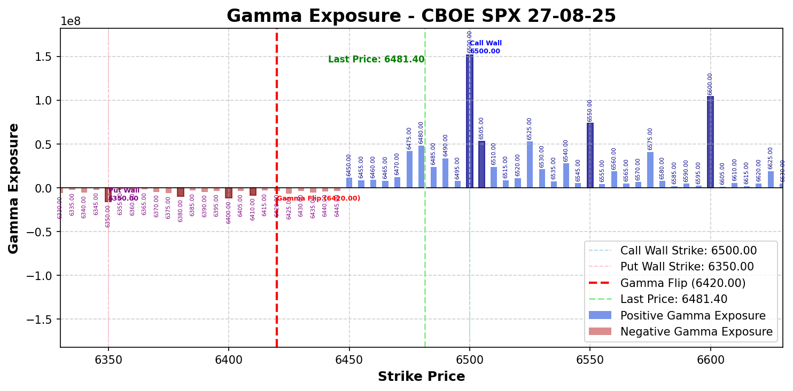
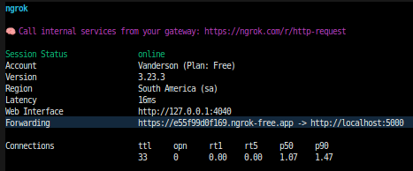

# Gamma Exposure Indicator

**Gamma Exposure Indicator** is a Python tool with a modular and extendable architecture using Playwright that automates the download of Financial Assets such as S&P 500 options CSV files from CBOE, calculates the dealer's Gamma Exposure (GEX) Metrics and build structured charts with the results from the data analysis. It supports crawling ETFs (SPY), Spots (SPX), Futures (ES), Commodities, etc.




---

## Features

- Crawl CBOE pages for any Financial Asset options.
- Download and save structured options CSV files.
- Calculate the Dealers and Market Makers Gamma Exposure (GEX) Metrics, including the Flip Gamma.
- Structure the analysis result's visualization into charts.
- Generate a Pine Script to simply copy and paste into Code Editor of Trading View, to automatically plot the lines.

---

## Installation

1. Clone the repository:
- SSH
```bash
$ git clone git@github.com:VandersonTorres/gamma-exposure-indicator.git
```
- HTTPS
```bash
$ git clone https://github.com/VandersonTorres/gamma-exposure-indicator.git
```

2. (Optional) Create a virtual environment:
```bash
$ python -m venv venv
$ source venv/bin/activate  # Linux/Mac
$ venv\Scripts\activate     # Windows
```

3. Install dependencies:
```bash
$ pip install -r requirements.txt
```

4. Install Playwright browsers:

```bash
$ playwright install
```

5. Install pre-commit:

```bash
$ pre-commit install
```

6. Create a .env file and fill the environment variables you may need
```bash
cp ./src/env.sample ./src/.env
```

---

## Usage

**You can run the software via Telegram Bot by starting the Bot at [GEX Indicator Bot](http://t.me/GEXIndicatorBot)**

**Or by terminal using the `app.py` passing (or not) the following arguments:**

- URLs: Comma-separated URLs to crawl (url1,url2,url3). Default: `https://www.cboe.com/delayed_quotes/spx/quote_table`

- Expiration Type: Type of expiration. Supported values:
1. all (default)
2. standard
3. weekly
4. quarterly
5. monthly

- Expiration Month: Expiration month (in Portuguese). Supported values:

1. all (default)
2. janeiro, fevereiro, etc...

### Telegram Bot Usage Guide

1. Start NGROK:
```bash
$ ngrok http 5000
```

2. Copy the generated URL at the field "Forwarding" and paste it into your .env file (`WEBHOOK_DOMAIN`):


3. Start the webhook:
```bash
$ python run_webhook.py
```

4. Start the Telegram BOT [GEX Indicator Bot](http://t.me/GEXIndicatorBot)

5. Once you do this process, you no longer need further actions in the terminal. All commands are made through the Telegram.

### Terminal Usage Guide

*Ensure you are inside `gamma-exposure-indicator` dir*
```bash
$ cd gamma-exposure-indicator
```

*NOTE: You can combine multiple args*

0. **HELP MODE:**
```bash
$ python app.py -h
```

1. **Download all options for SPX for all expirations:**
```bash
$ python app.py
```

2. **Download only 0DTE options (Zero Days to Expiration):**
```bash
$ python app.py --zero_dte True
```

3. **Download all standard expiration options for SPX:**
```bash
$ python app.py --expiration_type standard
```

4. **Download all options for SPX expiring at august:**
```bash
$ python app.py --expiration_month agosto
```

5. **Isolate the view of GEX results for both call and puts separatedly, on the charts:**
```bash
$ python app.py --split_visualization True
```

6. **Calculate Gamma Flip Point:**
```bash
$ python app.py --flip_point True
```
- **Output**:

    CSV, Processed JSON files, and Reports (Charts PNG) will be saved in the directories specified in `src/settings.py`.

    A Pine Script will be showed to simply copy and paste into Code Editor of Trading View. This will plot the lines.

---

## Notes
The downloader is built with Playwright (sync API). Ensure browsers are installed via playwright install.

The tool handles cookie popups automatically.

Designed to be modular, so adding other platforms downloads or analytics features is straightforward.

---

# STUDY

## MARKET MAKER SCENARIOS (MM Behavior)

### Volatility Compression
*(Market Maker is long options, tends to stabilize the market.)*

1. Buying Calls:

    D + | G +

    - If the market goes up  ->  Sell the Underlying
    - If the market goes down ->  Buy the Underlying
    (buy the dip | sell the top)

    Explanation:
    - If the price rises, DELTA (+) increases, so the MM neutralizes delta by selling the underlying.
    - If the price falls, DELTA (+) decreases, so the MM neutralizes by buying the underlying.

2. Buying Puts:

    D - | G +

    - If the market goes up  ->  Sell the Underlying
    - If the market goes down ->  Buy the Underlying
    (buy the dip | sell the top)

    Explanation:
    - If the price rises, DELTA (-) decreases (becomes less negative), so the MM neutralizes by selling the underlying.
    - If the price falls, DELTA (-) increases (becomes more negative), so the MM neutralizes by buying the underlying.

### Volatility Expansion
*(Market Maker is short options, tends to amplify market movements.)*

1. Selling Calls:

    D + | G -

    - If the market goes up  ->  Buy the Underlying
    - If the market goes down ->  Sell the Underlying
    (buy the top | sell the bottom)

    Explanation:
    - If the price rises, DELTA (+) increases, but since the MM is short calls, risk increases, so they need to buy the underlying to hedge.
    - If the price falls, DELTA (+) decreases, so the MM needs to sell the underlying.

2. Selling Puts:

    D - | G -

    - If the market goes up  ->  Buy the Underlying
    - If the market goes down ->  Sell the Underlying
    (buy the top | sell the bottom)

    Explanation:
    - If the price rises, DELTA (-) decreases (becomes less negative), so the MM needs to buy the underlying.
    - If the price falls, DELTA (-) increases (becomes more negative), so the MM needs to sell the underlying.
